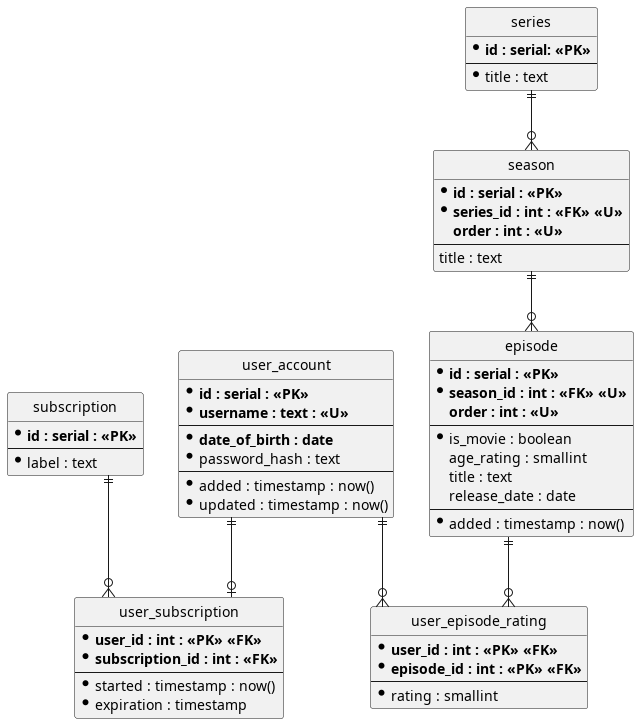

# Database Design: Video Streaming Service

This is a database design for an online video streaming service (like Netflix) using PostgreSQL 14.

It will store information about users and their account details and subscriptions, as well as the what content is available, its metadata, and how the content is structured in terms of season and episode order.

## Entity Relationship Diagram

- indicates a `NOT NULL` attribute.

**Bold** indicates a primary or foreign key.

## Tables

### user_account

This table represents a user account used to access the service.

|     Column      |   Type    | Constraint |  Default  | Nullable | Notes                                                                     |
| :-------------: | :-------: | :--------: | :-------: | :------: | :------------------------------------------------------------------------ |
|      `id`       |  Serial   |     PK     | Increment |    No    |                                                                           |
|   `username`    |   Text    |   Unique   |           |    No    |                                                                           |
| `password_hash` |   Text    |            |           |    No    | Can be changed to `char(n)` once hashing algorithm/parameters are chosen. |
| `date_of_birth` |   Date    |            |           |    No    | Used to hide or block access to mature content.                           |
|     `added`     | Timestamp |            |  `now()`  |    No    | Automatically managed by DBMS.                                            |
|    `updated`    | Timestamp |            |  `now()`  |    No    | Uses a trigger to execute `update_timestamp()` on update.                 |

### subscription

This table represents subscription tiers that each offer varying levels of content and features from the service.

| Column  |  Type  | Constraint |  Default  | Nullable | Notes |
| :-----: | :----: | :--------: | :-------: | :------: | :---- |
|  `id`   | Serial |     PK     | Increment |    No    |       |
| `label` |  Text  |            |           |    No    |       |

### user_subscription

This table represents active user subscriptions.

|      Column       |   Type    | Constraint | Default | Nullable | Notes                                            |
| :---------------: | :-------: | :--------: | :-----: | :------: | :----------------------------------------------- |
|     `user_id`     |    Int    |   PK, FK   |         |    No    | PK as a user cannot have multiple subscriptions. |
| `subscription_id` |    Int    |     FK     |         |    No    |                                                  |
|     `started`     | Timestamp |            | `now()` |    No    |                                                  |
|   `expiration`    | Timestamp |            |         |    No    |                                                  |

### series

This table represents TV or movie series and is essentially a parent to `season` and `episode` tables.

| Column  |  Type  | Constraint |  Default  | Nullable | Notes |
| :-----: | :----: | :--------: | :-------: | :------: | :---- |
|  `id`   | Serial |     PK     | Increment |    No    |       |
| `label` |  Text  |            |           |    No    |       |

### season

This table represents an individual season of a series.

|     Column     |   Type    | Constraint |  Default  | Nullable | Notes                                                               |
| :------------: | :-------: | :--------: | :-------: | :------: | :------------------------------------------------------------------ |
|      `id`      |  Serial   |     PK     | Increment |    No    |                                                                     |
|  `series_id`   |    Int    | FK, Unique |           |    No    |                                                                     |
| `series_order` | Small int |   Unique   |           |   Yes    | Nullable - for instance, if there is only one season in the series. |
|    `title`     |   Text    |            |           |   Yes    |                                                                     |

`series_id` & `series_order` are both in one unique constraint.

### episode

This table represents an instance of streamable video. This may be an episode of a series, or a feature length film. 

|     Column     |   Type    | Constraint |  Default  | Nullable | Notes                                                                                           |
| :------------: | :-------: | :--------: | :-------: | :------: | :---------------------------------------------------------------------------------------------- |
|      `id`      |  Serial   |     PK     | Increment |    No    |                                                                                                 |
|  `season_id`   |    Int    | FK, Unique |           |    No    |                                                                                                 |
| `season_order` | Small int |   Unique   |           |   Yes    | Nullable - for instance, if there is only one episode (a movie without a sequel etc.)           |
|    `inode`     |    Int    |   Unique   |           |    No    | Essentially a file ID on the file system.                                                       |
|   `is_movie`   |  Boolean  |            |           |    No    | Front-end will make use of this distinction.                                                    |
|  `age_rating`  | Small int |            |           |   Yes    | Minimum age in years. Used with `user_account.date_of_birth` to limit access to mature content. |
|    `title`     |   Text    |            |           |   Yes    |                                                                                                 |
| `release_date` |   Date    |            |           |   Yes    |                                                                                                 |
|    `added`     | Timestamp |            |  `now()`  |    No    | Automatically managed by DBMS.                                                                  |

### user_episode_rating

This table represents a compound key including a user's rating of an episode, perhaps from 0 - 10.

|    Column    |   Type    | Constraint | Default | Nullable | Notes |
| :----------: | :-------: | :--------: | :-----: | :------: | :---- |
|  `user_id`   |    Int    |   PK, FK   |         |    No    |       |
| `episode_id` |    Int    |   PK, FK   |         |    No    |       |
|   `rating`   | Small int |            |         |    No    |       |

## update_timestamp() Trigger

It's usually best not to use database triggers and rather keep business logic in the application code. For one, triggers are not always obvious and can be forgotten about. Also the business logic becomes coupled with the database implementation and won't be checked into version control.

There is, however, one use case for a PostgreSQL database where it is useful and that is to replicate MySQL's `ON UPDATE CURRENT_TIMESTAMP` functionality.

A trigger function is defined called `update_timestamp()` which sets the `updated` column value for the row to `now()`. This is applied as an `ON UPDATE` trigger for various tables with an `updated` column that contains a timestamp.
